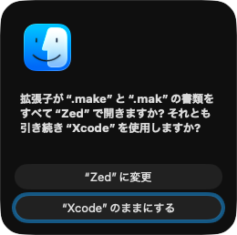

# utisuna

**utisuna [うちすな]** is a tiny macOS command-line tool that sets the default app for the **content type of a sample file**.

In plain English:

```bash
utisuna /path/to/sample.txt /Applications/SomeApp.app
```

uses the content type of `sample.txt` and asks macOS to make `SomeApp.app` the default app for that type.

That means the change applies to the **resolved content type**, not only to one path. For example, if the sample file resolves to `public.plain-text`, other plain-text files of the same type will follow the same default app.

## Installation
```bash
brew install rioriost/tap/utisuna
```

The Homebrew binary requires **Apple Silicon (arm64) and macOS 12 or later**.
Intel users must build from source with a compatible Swift toolchain.

## Usage

```bash
utisuna [--dry-run] [--verbose] [--role all] [--] <sample-file> <application.app>
```

When you actually apply a change, macOS may show a confirmation dialog before switching the default app.



### Examples

Set Makefiles to open with Zed:

```bash
utisuna /path/to/Makefile /Applications/Zed.app
```

Preview without making changes:

```bash
utisuna --dry-run ~/src/project/Makefile /Applications/Zed.app
```

Set Markdown files to open with BBEdit:

```bash
utisuna ./README.md /Applications/BBEdit.app
```

## Why this exists

`utisuna` is for the slightly different workflow:

- point at a real file
- point at an app
- let macOS resolve the content type for you
- set the default app for that type

It is intentionally small and boring.

## Requirements

- Runtime: macOS 12 or later.
- Homebrew/release binaries: Apple Silicon (arm64).
- Source builds: Swift 6.0 or later with Swift Package Manager (Xcode 16 or later
  when using the bundled toolchain). The build host must satisfy that toolchain's
  own macOS requirements.

## Build

```bash
swift build -c release
```

Binary path:

```bash
.build/release/utisuna
```

## Behavior notes

- `utisuna` uses the sample file only to resolve its content type.
- Samples must be regular files or recognized package documents, not ordinary
  directories or special files. The destination must be a valid application bundle.
- The update is performed through macOS APIs, not by editing Launch Services plist files directly.
- `--role all` is accepted for compatibility. Role-specific changes (`editor`,
  `viewer`, `shell`, or `none`) are unsupported and are rejected before making
  changes; older versions silently ignored these values.
- `--verbose` adds information about the scope of the change and system consent.
- Use `--` before paths beginning with `-`.

## Development

Run tests:

```bash
make test
```

This runs the Swift tests and isolated release-workflow tests (Python 3 required).
Release tests use temporary repositories and command stubs, without changing
default applications, accessing signing credentials, or publishing anything.
Run only the Swift tests with `swift test`, or release tests with `make test-release`.
Custom build directories are supported, for example `make test BUILD_DIR="/tmp/utisuna build"`.

## Releases

Distribution builds target arm64 and macOS 12. Build, notarization and publishing
are separate operations. No target implicitly overwrites an existing archive or
published release.

1. Update `CLI.version` and release notes, run `make test`, and commit the changes.
2. Tag that exact clean commit, for example `git tag 0.1.3`.
3. Configure `SIGN_IDENTITY` and an existing `NOTARY_PROFILE` keychain profile.
   For publishing, also set `HOMEBREW_TAP_PATH` to a clean, synchronized checkout
   of `rioriost/homebrew-tap` on `main`.
4. Choose one of these flows:

```bash
# Unsigned local package in build/unsigned; no signing or publishing.
make release TAG=0.1.3

# Sign and notarize once in build; never publish.
make notarize TAG=0.1.3

# Publish that same accepted archive, without rebuilding or signing again.
make resume TAG=0.1.3

# Alternatively, build, notarize and publish a new release in one operation.
make publish TAG=0.1.3
```

`make publish` checks the tag, tap and GitHub release before building. It refuses
an existing release. `make resume` accepts an existing release only when the
downloaded zip and checksum match the local artifacts byte-for-byte. If a tap
push fails, keep the artifacts and retry `make resume`; the script does not
automatically rebase or overwrite unrelated tap work. Remote changes to the tap
may require manual reconciliation before retrying.

The archive, portable `.sha256`, source-commit receipt, notarization receipt and
generated Formula are kept together in `build`. Keep these files for resuming.
To verify a downloaded archive, run `shasum -a 256 -c utisuna-0.1.3-macos.zip.sha256`
from its download directory.

`docs/utisuna.rb.template` is the single Formula template. Release scripts write
the generated Formula beside the archive, leaving the source worktree clean.
After publication succeeds, copy that generated Formula to `Formula/utisuna.rb`
and commit it separately; keep the release tag on the source commit that built
the executable. To resume an already-published release after further commits,
use a clean checkout of its source tag and the original artifacts. Resume does
not push the source branch when the GitHub release already exists.

The scripts support `BUILD_DIR`, `ARTIFACTS_DIR`, `SWIFT`, `CONFIGURATION` and
`OUTPUT_BASENAME`. `NOTARIZE=1 scripts/release.sh <tag>` creates a notarized local
archive; publishing is opt-in with `--publish` or `--resume`. Notarization uses
an existing keychain profile and never stores raw Apple ID passwords.

## Project layout

```text
utisuna/
├── Package.swift
├── README.md
├── Sources/
│   └── utisuna/
│       ├── CLI.swift
│       ├── DefaultAppSetter.swift
│       ├── Runner.swift
│       └── main.swift
└── Tests/
    └── utisunaTests/
        ├── CLITests.swift
        └── RunnerTests.swift
```

## License

MIT
